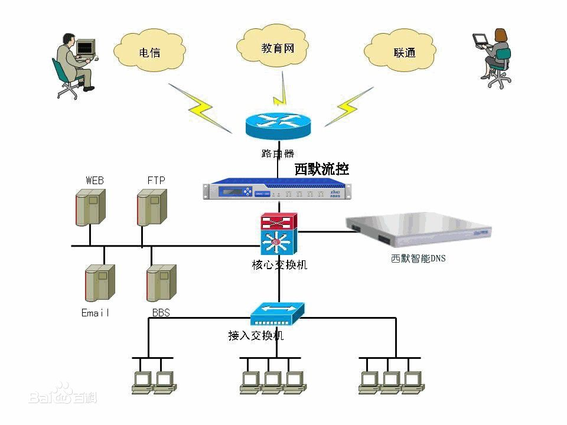

**Learn-Catalog**
p6/p7学习标准

# 1 关于Http算法深入和浏览器工作原理

## 1.1 URI URL 语法和编码
### 1.1.1 URI：
文本字符串的一种标准，URI表示的是句法结构，表示web资源的字符串的各个部分。
URI: 统一资源标识符。
URL: 统一资源定位符。
<strong>URL是URI的子集。</strong>

因为URI还包括一个子类：统一资源名称(URN)，它可以命名资源但不指定如何定位资源，可以找到资源，但是不包含资源的位置信息，例如：mailto:cay@hostname.com，news等都是URI的URN示例。

<b>URI 可以是相对的，也可以是绝对的。
对URI字符串按照一般语法进行解析</br>
不考虑它所指定的方案，</br>
不对主机执行查找，</br>
不构造对应方案的处理程序，</br>
相等性，哈希计算都比较严格的根据实例的字符内容进行定义，
</b>

类似于一个支持语法意义、依赖于方案的比较、规范化、解析、相对化计算的结构化字符串。

URL的语法组成代表了它描述的资源所需的信息。URL是绝对的，必须始终指定一个具体的方案。事实上URL的处理需要一个流程序，无法对没有提供处理程序的方案创建URL。作为结构化的字符串，URL支持查找主机和打开相应网络资源的网络IO操作。

### 1.1.2 在Java中意义:

URI类不包含任何访问资源的方法，不能访问，只能解析，唯一的作用是解析资源。
URL类可以打开一个到达资源的流。因此URL类只能作用于那些Java类知道如何处理的模式。
URL类还有两耳重要的方法：
openStream() 打开到此URL的链接并返回一个用于从该链接读入的InputStream
openConnection() 返回一个URLConnection对象，它表示到URL所引用的远程对象。
```
URL url = new URL("http://www.baidu.com");
 InputStream in = url.openStream();
 ByteArrayOutputStream output = new ByteArrayOutputStream();
 byte[] buffer = new byte[1024];
 int len = -1;
 while ((len = in.read(buffer)) != -1)
 {
    output.write(buffer, 0, len);
 }
 System.err.println(new String(output.toByteArray()));
```

### 1.1.3 web URL地址

http://www.baidu.com/img/?query=123#abc <br>

组成部分<br>
schemas: 协议部分 标识使用的传输协议类型。<br>
//: 分隔符。<br>
domainName: 域名部分 www.baidu.com<br>
port: 服务器端口号。<br>
/path/to/resource 虚拟目录 <br>
index.html 文件名部分 <br>
/# frag anchor: 锚点部分。<br>
?query_string: 参数部分。 // ?query=123 location.search<br>


## 1.2 DNS
### 1.2.1 DNS作用
将域名解析成对应的IP地址， 方便访问服务器<br>
### 1.2.2 DNS原理
DNS由解析器和域名服务器组成<br>
域名服务器有一张表，保存该网络中所有域名和IP地址的映射关系，并可以将域名转为IP地址<br>
DNS采用类似目录树的等级结构。<br>
域名到IP的映射过程叫‘域名解析’，域名和IP之间是多对一或一对一的关系。<br>
域名便于记忆，访问网址只要输入域名，域名转换为IP的过程由DNS来完成。<br>
公用的DNS有114.114.114.114/119/110、205.252.144.228公用DNS地址，或者局域网内自己的DNS服务<br>

### 1.2.3 DNS结构图


## 1.3 Http报文头，实体，方法

## 1.4 TCP链接和Nagle算法

## 1.5 并行链接和持久链接 以及keep-alive

## 1.6 Content-Length等头部信息

## 1.7 缓存

```
nginx :
location ~ .*\.(gif|jpg|jpeg|png|bmp|swf)$ {
    #过期时间为30天，
    #图片文件不怎么更新，过期可以设大一点，
    #如果频繁更新，则可以设置得小一点。
    expires 30d;
}
location ~ .*\.(js|css)$ {
    expires 10d;
}
```

### 1.7.1 缓存解决的问题
### 1.7.2 缓存的处理步骤
### 1.7.3 Http缓存
### 1.7.4 缓存算法 FIFO LFU LRU
### 1.7.5 不同服务器缓存的配置


## 1.8 服务器基本原理

## 1.9 浏览器渲染流程

### 1.9.1 HTML解释器

### 1.9.2 css解释器

### 1.9.3 js引擎： 语法树分析，访问者模式 

### 1.9.4 DOM树

### 1.9.5 RenderObject

### 1.9.6 布局测试

# 2 Linux

## 2.1 Linux概念

## 2.2 用户和用户组

## 2.3 目录管理

## 2.4 vim

## 2.5 shell

## 2.6 进程管理

## 2.7 linux网络服务

## 2.8 Docker

### 2.8.1 Docker的概念
### 2.8.2 Docker的应用
### 2.8.3 镜像和容器
## 2.9 CDN
### 2.9.1 OSS概念
### 2.9.2 OSS优势
### 2.9.3 CDN
### 2.9.4 缓存
### 2.9.5 灰度发布


# 3 代理服务
## 3.1 正向代理
### 3.1.1 什么是正向代理
  用户需要访问某个网站，但是不能直接访问到这个网站，不过有一台服务器可以访问这个网站的服务器，
  而且，这个用户是可以访问这个网站的，然后用户可以把这个访问某一个网站的任务交给这个服务器，
  这个服务器就是代理服务器，这种访问方式就是正向代理。
### 3.1.2 用途
  - 访问原来无法访问的资源，例如： google
  - 可以做缓存， 加速访问资源
  - 对客户端添加权限，上网需要认证
  - 代理可以记录用户访问记录，对外隐藏用户信息

## 3.2 反向代理
### 3.2.1 什么是反向代理
  反向代理对外是透明的，用户不需要知道是不是在访问目标服务器，也不需要添加任何配置。
  客户端并不知道是代理在代替访问资源服务器。以代理服务器来接受internet上的请求，
  并将从服务器上得到的结果返回给internet上请求的客户端，此时代理服务器表面上看就是服务器。
  反向代理，代理的是服务器，作为服务器的代理，相当于一个服务器组的一个对外接口。

### 3.2.2 反向代理作用
 - 保证内网的安全(从服务器角度考虑)，组织web攻击网站，将内网和公网进行了划分。
   反向代理服务器，外网ip与客户端同网段，内网ip与服务端同网段。
 - 负载均衡， 通过反向代理优化网站的负载。

### 3.2.3 代理的总结
 - 正向代理 ， 客户端和代理服务器在同一个网段，代理服务器代理的是客户端，代理只能去访问这个服务器，多对一的关系。
 - 反向代理 ， 服务器和代理服务器在同一个网段，代理服务器代理的是服务端，可以配置多个服务器提供服务，是多对多关系。
   实现负载均衡的目的，后台有多个服务器在工作，但对外暴露的只是代理服务器的地址。


## 3.3 Nginx
- 目前比较流行的反向代理服务器。
config http://www.jb51.net/article/31273.htm

# 4 node.js

# 5 webpack 自定义loader


